# Hiro Compose 架构

## 设计目标

Hiro Compose 的目标，是让 Android API 24+ 直接运行 Skiko/Skia 版 Compose，而非 AndroidX Compose。

这使得：

- 低版本 Android 也能使用 SkSL Shader
- Android、Desktop、WASM、iOS 可复用同一套 Skiko Compose UI 与视觉实现

核心模式：

```text
Hiro Compose
= 固定上游底板
+ 顶替（剥离不适用实现 + 提供同包同名实现）
+ Android/Skiko 胶水
+ Hiro 自有能力
```

## 固定底板

Hiro 目前以 CMP 1.11.1 的 Desktop 变体作为固定底板。Desktop 本就是 Skiko Compose 的一具体平台实现，并且与 Android 同属类 JVM 体系，适合作为移植基线。

Hiro 不直接维护一份 Compose Multiplatform 源码自行老改，原因是上游代码和 Hiro 介入点会混在一起，难以审计真实修补面、形成成熟的修补方案，且难以升级上游：升级时需要重新拉取上游源码并重新大量修改源码

Hiro 将官方二进制工件作为输入，通过声明式处理为 Processed Jar 依赖。升级上游时，只需要重新小量调修顶替与垫片。

## 构造模式

### 底板

我们在 `packages/compose/build.gradle.kts` 中如上文所述地固定了上游工件为底板。

### 顶替

我们的顶替，严格等于：

```text
从 Processed Jar 剥离原实现
+ 在 Hiro 源码中提供同包、同名、同 ABI 实现
```

典型顶替包括：

- Android 不兼容的 Compose 平台实现
- Lifecycle Compose 的线程绑定实现
- `collectAsStateWithLifecycle` 的调度实现
- `LocalViewModelStoreOwner` 的 Android ViewTree 回退
- Navigation3 的 ViewModel 装饰器
- Savable（注：官方拼写成 Sav**e**able，而我采取当前拼写）序列化入口

顶替不是运行时 Hook，也不是依赖解析的偶然性覆盖，而是确定的、稳定的。原类在 Jar Processing 中精准剥离，再由 Hiro 提供**船新**实现。

### 胶水

胶水负责连接 Android 宿主与 Skiko Compose 世界：

- `MotionEvent` -> `ComposeScenePointer`
- View 尺寸、Density、Insets、安卓主题模式、触摸输入与IME等等 -> `PlatformContext` 状态
- Activity Lifecycle -> Hiro Lifecycle
- Android BackDispatcher 与 Hiro Navigation 的双向握手
- Android Bundle 与 Hiro SavedState 的快照运输
- Choreographer 帧信号驱动 Skia 按需绘制

胶水不拥有 Composition、ViewModelStore 或 SavedStateRegistry，也不在 Android 主线程执行 Compose 行为。

### Hiro 自有能力

Hiro 独立提供：

- `HiroComposeView`
- `HiroSkiaLayer` 与 `HiroSkiaSurfaceView`（实现在 Hiro Skia 中，严格来说不在 Hiro Compose）
- Compose、Skia、GL 同线程的直通渲染管线
- Hiro Architecture Components Owner
- 输入合流、IME、窗口信息、Insets、Back 等 Android 适配
- 添头：Savable 自动 Kotlinx Serialization 编解码、可客制化的 HiroSavableStateCodec

## 构建期纯洁性

采用 Hiro 时，Compose 相关包**只能由 Hiro 提供**。我们另提供了 HGP 负责治理消费侧依赖：

Hiro 自身模块 → 直接放行
官方 Compose 模块 → 阻断
官方 Lifecycle/SavedState 适配层 → 阻断
第三方 KMP Compose 库 → 选择 Skiko/Desktop 变体
最终 classpath → 做所有权与类泄漏校验

基础 `androidx.lifecycle.ViewModel`、`Lifecycle`、`SavedState` 等类型仍由 Android 与 Hiro 共用。Hiro 接管的是它们的 Compose 适配层，以及运行在 Hiro 行政区内的 Owner 实例。

## 一个世界，两个“行政区”

Hiro 不隔离 ClassLoader，也不克隆基础架构类型。Android 与 Hiro 位于同一进程、同一类型世界，可以共享业务对象和依赖注入容器；但各自拥有**线程敏感**的可变 Owner。

| 行政区     | 持有者线程              | 持有内容                                                                                                |
|:--------|:-------------------|:----------------------------------------------------------------------------------------------------|
| Android | 主线程                | Activity、Android Lifecycle、BackDispatcher、Android SavedStateRegistry                                |
| Hiro    | Hiro Render Thread | ComposeScene、Composition、Hiro Lifecycle、Hiro ViewModelStore、Hiro Navigation、Hiro SavedStateRegistry |

二者共享：

- 同一个 `androidx.lifecycle.ViewModel` 类型
- 同一个 Koin 容器
- 普通业务对象、Repository 和不可变数据

二者不共享：

- 同一个 `LifecycleRegistry`
- 同一个 `ViewModelStore`
- 同一个 `SavedStateRegistry`
- 任何具有固定线程所有权的可变 Owner

因此，Activity ViewModel 与 Hiro 屏幕 ViewModel 可以使用同一种类型和同一个 Koin 容器，但它们由不同的 `ViewModelStoreOwner` 定义作用域，不会互相清理或越过线程边界。

## 线程所有权与跨区通道

“两条核心线程”特指 Hiro Compose 关键路径上的两个线程所有权域，并不表示应用进程不能存在 IO、网络或业务工作线程。

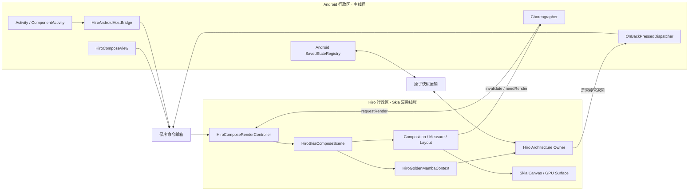

线程不变量：

- Android 主线程只采集平台事件、更新宿主关系和安排帧
- Composition、Snapshot Apply、Measure、Layout、手势消费和 Draw 由 Skia 渲染线程执行
- EGL、Skia GPU Surface、Canvas 只由 Skia 渲染线程访问
- Compose Runtime 的全局 Snapshot Apply 任务由 `HiroSnapshotApplyDispatcher` 投递给已注册的 Hiro 渲染调度器；尚无调度器时暂存，不回落到 Android Main
- 跨区可变数据只能通过命令或快照副本运输
- 不把 Android Owner 暴露给 Hiro Composition，也不把 Hiro Owner 交给 Android 主线程操作

## 启动与关闭时序

### 启动

`setContent` 可以先于渲染线程和 Surface 就绪。内容会先进入命令邮箱，直到渲染线程可用并且存在有效 Viewport 后才创建 Scene。

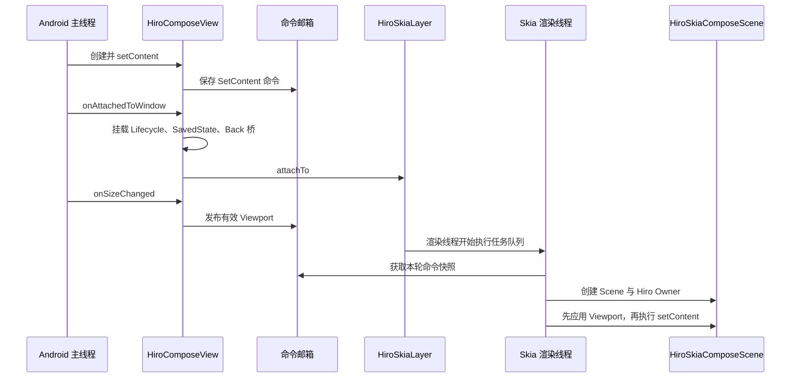

Scene 创建的关键前置条件是“渲染线程可执行任务”与“Viewport 为正尺寸”，不要求 GPU Surface 已经就绪。GPU Surface 由独立的 Renderer 状态机管理；首个可绘制 Surface 的尺寸仍会作为权威校正。

### 关闭

关闭是单向且不可逆的。主线程先封闭输入端，再阻塞等待渲染线程完成资源销毁，最后拆除 Android 宿主桥。

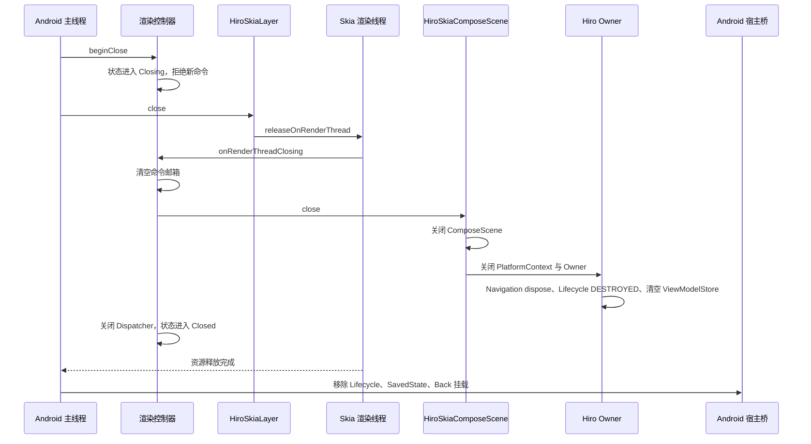

若 View 在渲染线程创建前就被关闭，则走无 Scene 的快速关闭分支，但状态仍然必须经过 `Closing -> Closed`。

## 正交状态机

运行时不是一张大状态机，而是几张职责不同、相互约束的状态机。Controller 是否拥有 Scene、宿主是否暂停、GPU Surface 是否可画、Hiro Lifecycle 位于什么等级，不混为一个状态。

### Compose 渲染控制器

`Running` 表示 Scene 已创建，不表示 Activity 一定处于前台。

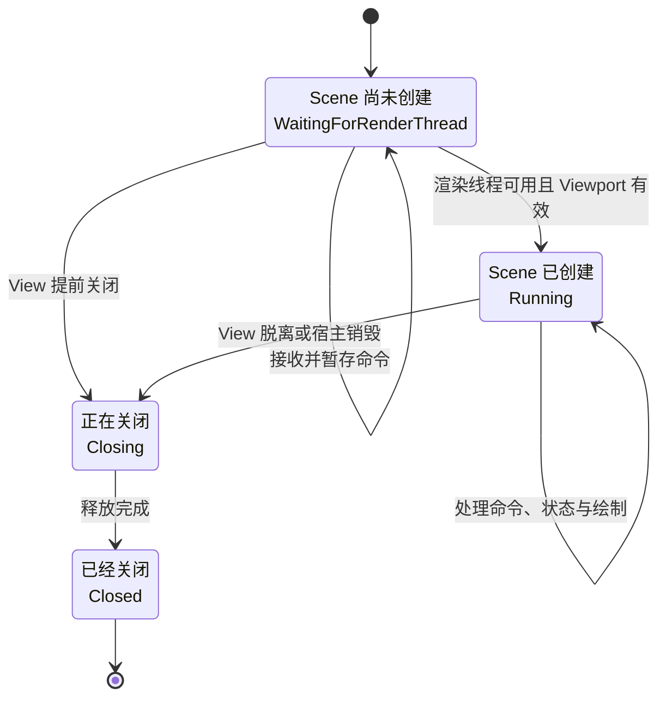

| Controller 状态            | 接受新命令 | Scene  |       允许绘制        |
|:-------------------------|:-----:|:------:|:-----------------:|
| `WaitingForRenderThread` |   是   |   无    |         否         |
| `Running`                |   是   |   有    | 取决于宿主和 Surface 状态 |
| `Closing`                |   否   | 正在释放或无 |         否         |
| `Closed`                 |   否   |   无    |         否         |

### Skia 宿主与 GPU Renderer

Skia 宿主控制帧循环是否运行；GPU Renderer 控制当前是否存在可绘制 Surface。暂停宿主不销毁 Compose Scene，Surface 重建也不重建 Hiro Owner。

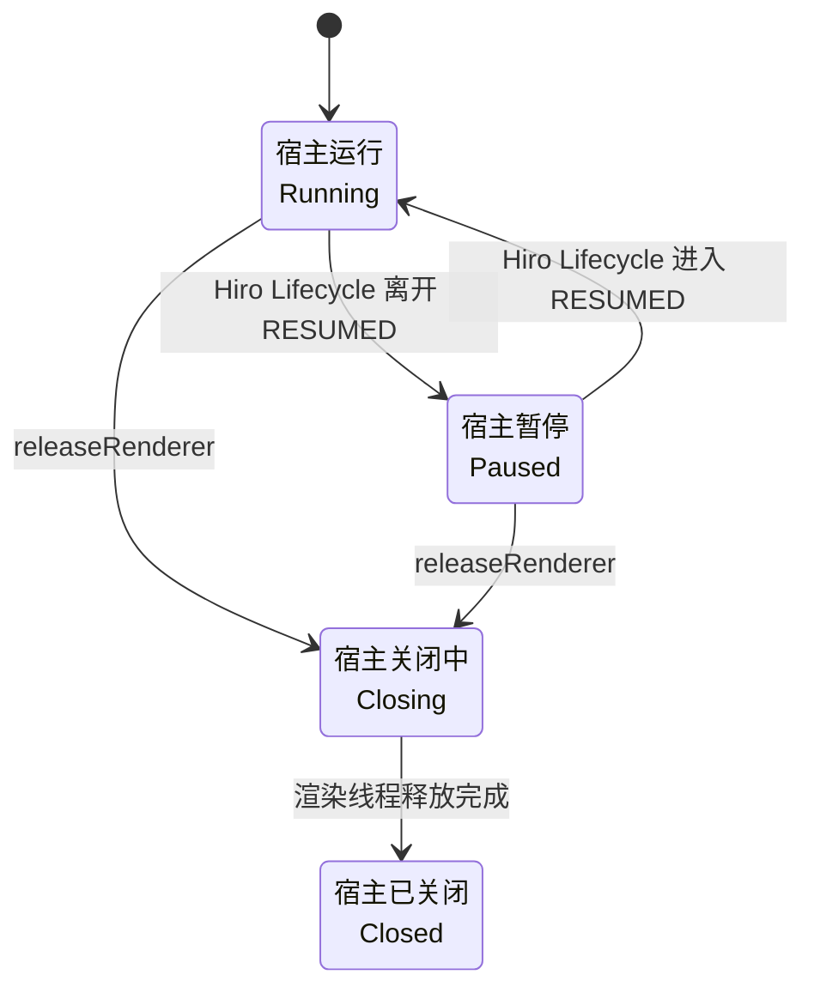

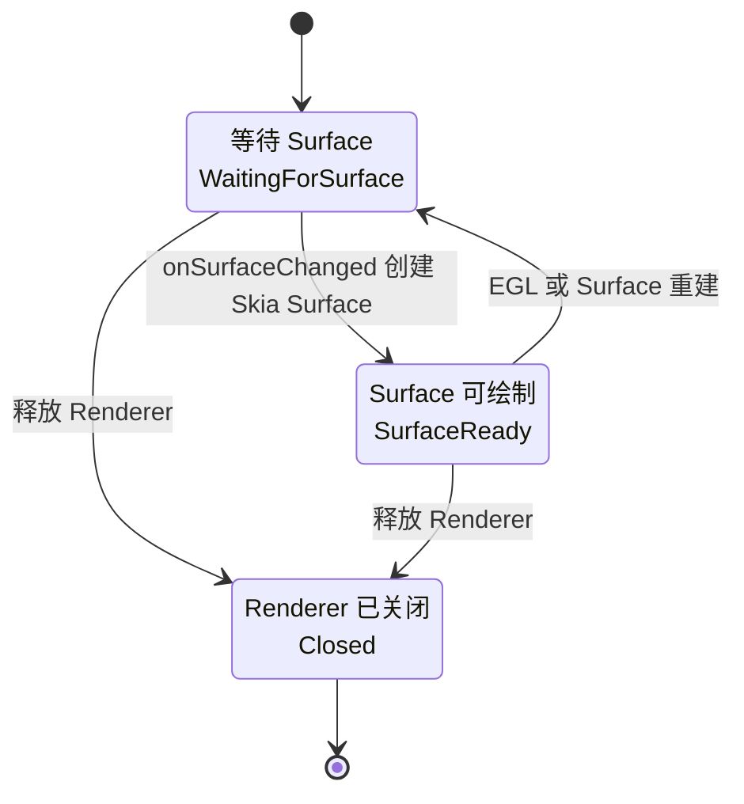

### Hiro Lifecycle

Android Lifecycle 只在主线程读取。`HiroComposeView` 结合宿主状态与 View 可见性计算目标状态，再以命令形式交给渲染线程上的 Hiro Owner。

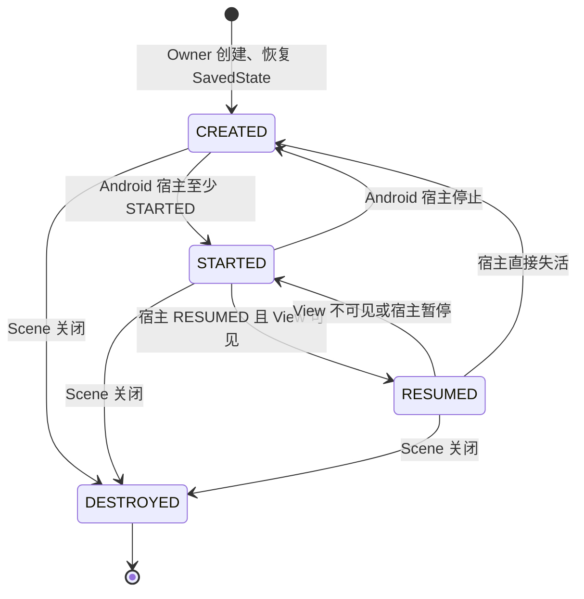

映射规则：

| Android 宿主与 View                        | Hiro Lifecycle | Skia 宿主             |
|:----------------------------------------|:---------------|:--------------------|
| 宿主 `RESUMED` 且 View 已挂载、可见              | `RESUMED`      | `Running`           |
| 宿主为 `STARTED`，或宿主为 `RESUMED` 但 View 不可见 | `STARTED`      | `Paused`            |
| 宿主低于 `STARTED`                          | `CREATED`      | `Paused`            |
| 宿主 `DESTROYED` 或 View 脱离                | `DESTROYED`    | `Closing -> Closed` |

Hiro Lifecycle 的不变量：

- Registry 由渲染线程创建并使用 `LifecycleRegistry.createUnsafe`
- 活动期间只迁移到 `CREATED`、`STARTED`、`RESUMED`
- `DESTROYED` 只由关闭流程产生
- 迁移到 `CREATED` 或 `STARTED` 时建立 SavedState 检查点
- `ViewModelStore.clear()` 只在 Hiro Owner 关闭时执行

若宿主没有 ViewTree LifecycleOwner，桥接层把宿主视为 `RESUMED`，由 View 的挂载与可见性提供降级驱动；这不会把 Android LifecycleRegistry 引入 Hiro 行政区。

## 按需直通帧循环

Hiro 使用 `RENDERMODE_WHEN_DIRTY`。没有失效、输入或平台状态变化时，不持续空转绘制。

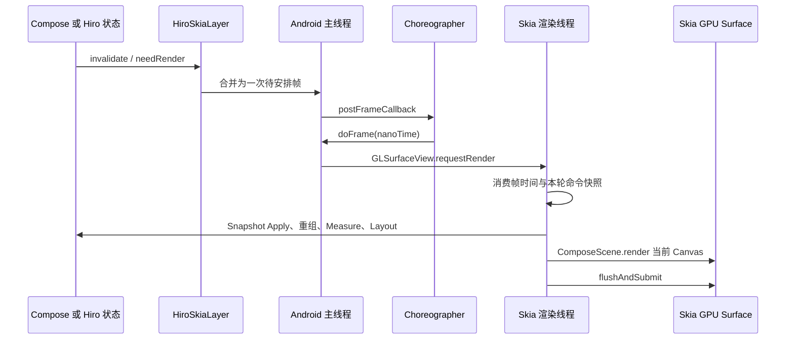

直接渲染链路是：

```text
ComposeScene -> 当前 GPU Surface 的 Skia Canvas -> flushAndSubmit
```

不存在 Compose 线程生成 SkPicture、GL 线程再回放的中间层。Composition、绘制指令生成、Skia Canvas 调用和 GPU 提交都发生在同一渲染线程。

## 命令邮箱与输入状态机

### 命令语义

主线程产生的内容、Lifecycle、Viewport、Insets、输入模式、Back 和指针事件统一进入 `HiroComposeCommandMailbox`。

- 指针等离散事件严格保序
- Environment、Viewport、Insets、InputMode 的数据使用原子快照表达“最新值”
- 每轮 drain 只消费进入该轮前的命令快照
- drain 期间新到达的命令留给下一轮，避免输入洪峰无限延长当前帧
- `Closing` 后邮箱停止接收命令并被清空

### 指针输入

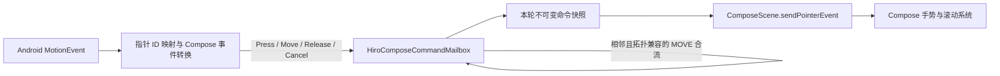

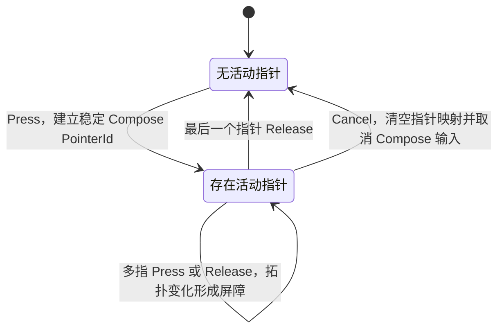

MOVE 合流规则：

- 只合流邮箱尾部相邻、类型均为 MOVE、指针拓扑兼容（“同一根手指”）的事件
- 保留最新位置、压力和事件时间
- 被折叠采样进入最近 100ms 的 `HistoricalChange`
- Press、Release、Cancel、普通命令和指针拓扑变化都是合流屏障
- 不损失总位移与速度追踪所需历史，因此慢速拖动与快速 fling 使用同一条正规输入路径

## SavedState 快照运输

Android SavedStateRegistry 与 Hiro SavedStateRegistry 从不共享实例。`HiroSavedStateTransport` 只运输 Bundle 副本，不代理 Registry 操作。

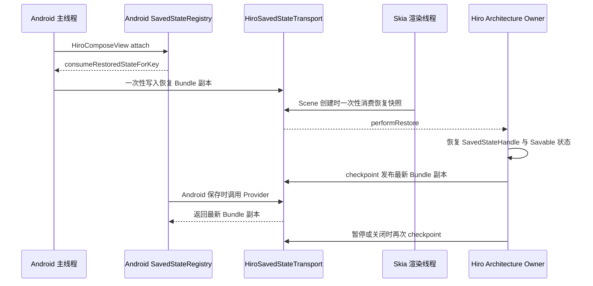

运输不变量：

- 恢复快照只能由 Android 主线程设置一次，并由 Hiro Owner 消费一次
- 每次跨线程读写都复制 Bundle
- Android 保存过程不进入 Hiro Registry，也不阻塞等待 Hiro 现场序列化
- Hiro 在初始化、离开前台和关闭时主动发布检查点
- 没有 Android SavedStateRegistryOwner 时，Hiro 状态仍可在当前会话内工作，但不能跨 Activity 重建恢复

Savable 在 Hiro Registry 内完成。官方可直接保存的值沿用基础规则；带有 Kotlinx Serialization 序列化器的对象可自动编解码；其他类型可以通过 `HiroSavableStateCodec` 扩展。Pager、Navigation 或其他上层组件不需要特例。

## Navigation Back 双向握手

Android 不直接访问 Hiro Navigation 栈。Hiro 先声明当前是否存在可处理返回的 Handler，Android 再决定是否启用 `OnBackPressedCallback`。

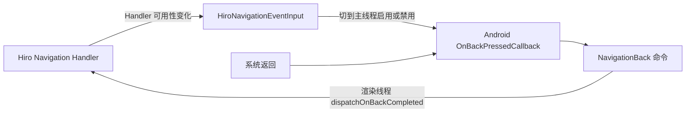

此闭环保证：

- 没有 Hiro Handler 时，Hiro 不拦截 Android 返回
- Handler 状态只在 Hiro 渲染线程判断
- Android Callback 只在主线程启停和接收系统事件
- 真正的 Navigation 状态迁移仍在 Hiro 渲染线程完成

## 主要代码落点

- [HiroComposeView](../packages/compose/src/main/kotlin/me/earzuchan/hiro/compose/HiroComposeView.kt)：Android 宿主入口、平台状态采集与生命周期映射
- [HiroComposeRenderController](../packages/compose/src/main/kotlin/me/earzuchan/hiro/compose/internal/HiroComposeRenderController.kt)：跨线程命令边界与 Compose 控制器状态机
- [HiroComposeCommandMailbox](../packages/compose/src/main/kotlin/me/earzuchan/hiro/compose/internal/HiroComposeCommandMailbox.kt)：命令保序、批次快照与 MOVE 合流
- [HiroSkiaComposeScene](../packages/compose/src/main/kotlin/me/earzuchan/hiro/compose/HiroSkiaComposeScene.kt)：ComposeScene、CompositionLocal 与 Skia Canvas 直通
- [HiroGoldenMambaContext](../packages/compose/src/main/kotlin/me/earzuchan/hiro/compose/internal/HiroGoldenMambaContext.kt)：Hiro 的 `PlatformContext` 实现，金曼巴这一块
- [HiroArchitectureComponentsOwner](../packages/compose/src/main/kotlin/me/earzuchan/hiro/compose/internal/architecture/HiroArchitectureComponentsOwner.kt)：Hiro Lifecycle、ViewModelStore、Navigation 与 SavedState Owner
- [HiroAndroidHostBridge](../packages/compose/src/main/kotlin/me/earzuchan/hiro/compose/internal/architecture/HiroAndroidHostBridge.kt)：Android Lifecycle、Back 与 SavedState 宿主桥
- [HiroSavedStateTransport](../packages/compose/src/main/kotlin/me/earzuchan/hiro/compose/internal/architecture/HiroSavedStateTransport.kt)：两行政区间的 Bundle 副本运输
- [HiroSkiaLayer 与 SurfaceView](../packages/skia/src/main/kotlin/me/earzuchan/hiro/skia)：EGL、Skia Surface、GPU 资源与帧调度
