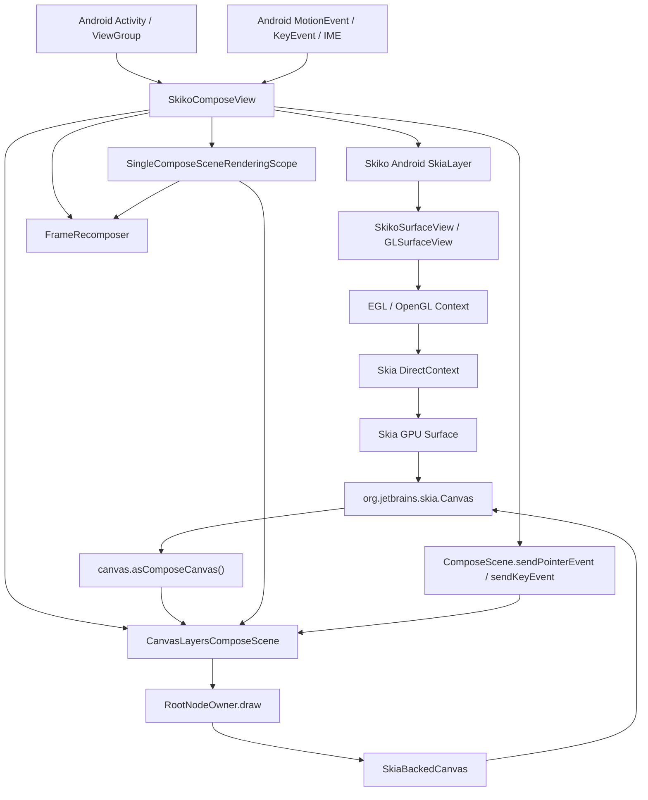
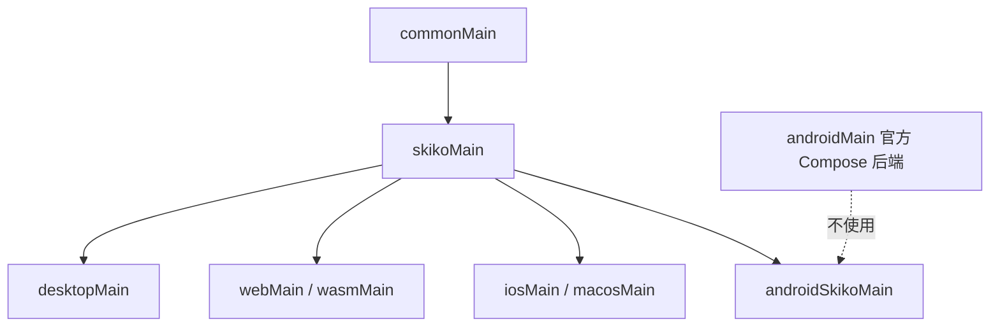

# Hiro：Compose Skiko Android 的初步架构说明与实施计划

项目名：**Hiro**（致敬我的爱人，`魔法少女ノ魔女裁判` 的 `二階堂 ヒロ`）。 
目标：在 Android 上实现一套 **不走 AndroidX Compose Android 后端**、而是走 **JetBrains Compose Multiplatform 的 Skiko/Skia 渲染链路** 的 Compose Host，使 Android 7 / API 24+ 能通过 Skia GPU backend 渲染出 Compose 界面，并吃上使用 SkSL 的 RuntimeEffect 等。

注：本文档为**初步设计**。不排除**在正式实现时具体技术细节与本文不符/推翻本文**的可能性.

---

## 核心结论

我们要做的不是“改造 AndroidX Compose”，也不是“在 Android Compose 里塞 Skia shader”。为什么：原版 AndroidX Compose 仍强绑定安卓View，这导致和安卓系统框架仍强关联，在低版本安卓（安卓12以下），将无法吃上带派的新版安卓Ripple，以及基于Shader的界面效果（比如仿 iOS26 的液态玻璃、仿 HyperOS 的高级材料）。

我们要做的是：

> **把 Compose Multiplatform 的 `skikoMain` Compose scene 搬到 Android View / Activity 上运行。**

也就是说，Android 只作为一个宿主平台，负责：

- 创建 View / Surface；
- 提供输入事件；
- 提供生命周期；
- 提供 density / layout direction / IME / accessibility 等平台能力；
- 让 Skiko 创建 Skia GPU surface；
- 把 Skia canvas 交给 Compose scene 绘制。

真正的 UI 树、布局、绘制、文本、图形、shader 都走：

```text
Compose Multiplatform common/skikoMain
  -> ComposeScene
  -> SkiaBackedCanvas
  -> org.jetbrains.skia.Canvas
  -> Skiko Android
  -> Skia GPU backend
  -> OpenGL / EGL / Android Surface
```

最低系统目标：

```text
minSdk = 24
```

核心能力目标：

```text
GPU rendering = yes
SkSL / RuntimeEffect = yes
Android RuntimeShader / AGSL = no dependency
AndroidX Compose Android Canvas/Node backend = no dependency
```

---

## 名词澄清：不是 AndroidX Compose，但包名仍可能是 `androidx.compose.*`

这是整个项目最容易被误解的地方。

### “AndroidX Compose”有两层含义

通常人们说 AndroidX Compose，可能指：

1. **包名 / API 命名空间**：`androidx.compose.*`
2. **Android 官方 Compose 后端实现**：`AndroidComposeView`、Android `Canvas`、`RenderNode`、HWUI、Android View interop 等

我们明确区分这两者。

### 我们不使用的部分

我们不使用 Android Compose 的 Android 后端：

```text
AndroidComposeView
Owner Android implementation
Android Canvas backend
RenderNodeLayer / ViewLayer
HWUI drawing path
Android graphics RuntimeShader / AGSL path
```

也就是说，我们不是：

```text
androidx.compose.ui.platform.ComposeView
  -> AndroidComposeView
  -> Android Canvas / RenderNode / HWUI
```

### 我们使用的部分

我们复用的是 Compose **Multiplatform** 的 Compose runtime / foundation / material 等上层实现。

JetBrains 仍将这些库的包名设为：

```text
androidx.compose.*
```

但这**不等于**我们使用 AndroidX Compose Android 后端。

我们的实际后端是：

```text
androidx.compose.* API / common logic
  + JetBrains Compose Multiplatform skikoMain implementation
  + Skiko Android rendering host
```

一句话：

> **包名叫 `androidx.compose`，不代表渲染后端是 AndroidX Compose Android。我们使用的是 Compose Multiplatform 的 Skiko Compose。**

---

## 总体架构

### 高层架构图



### 渲染链路

完整渲染路径：

```text
Activity / ViewGroup
  -> SkikoComposeView
    -> SkiaLayer.attachTo(viewGroup)
      -> SkikoSurfaceView / GLSurfaceView
        -> OpenGL framebuffer
          -> Skia backend render target
            -> Skia Surface
              -> Skia Canvas
                -> asComposeCanvas()
                  -> ComposeScene.render / draw
                    -> SkiaBackedCanvas
                      -> Skia native drawing
```

### Frame 链路

每一帧的逻辑：

```text
Skiko 请求 frame
  -> SkikoRenderDelegate.onRender(skiaCanvas, width, height, nanoTime)
    -> frameRecomposer.performFrame(nanoTime)
    -> scene.measureAndLayout()
    -> scene.draw(skiaCanvas.asComposeCanvas())
    -> Skia flush / GL present
```

推荐复用 CMP 的：

```text
FrameRecomposer
SingleComposeSceneRenderingScope
CanvasLayersComposeScene
```

这三者已经非常接近我们需要的非 Android Host 模型。

---

## 平台能力目标

### minSdk

框架底线：

```kotlin
minSdk = 24
```

原因：

- Skiko Android 官方支持 Android API 24 起；
- Android API 24 已具备我们需要的 EGL / OpenGL / GLSurfaceView 基础能力；
- SkSL 通过 Skia RuntimeEffect 实现，不依赖 Android 13+ 的 AGSL / RuntimeShader；
- 部分设备 GPU/driver 阉割不作为框架基线判断依据。

### GPU

目标：

```text
GPU rendering required
```

Skiko Android 当前走：

```text
GLSurfaceView
  -> OpenGL context
  -> Skia DirectContext
  -> Surface.makeFromBackendRenderTarget
```

因此我们的 Compose 绘制最终落在 Skia GPU surface 上。

### SkSL

目标：

```text
Skia RuntimeEffect / SkSL supported on Android API 24+
```

使用路径：

```kotlin
RuntimeEffect.makeForShader(sksl)
RuntimeShaderBuilder(effect)
paint.shader = builder.makeShader()
```

这不是 Android 的：

```text
android.graphics.RuntimeShader
AGSL
```

而是 Skia 自己的 RuntimeEffect / SkSL。

### GLES 版本

框架可支持 API 24，运行时希求 GPU 能力：

```text
OpenGL ES 3.0+ preferred / recommended
```

示例：

```xml
<uses-feature android:glEsVersion="0x00030000" android:required="true"/>
```

---

## 模块设计

### 不复用 AndroidX Compose UI artifact

不直接依赖：

```text
androidx.compose.ui:ui 的普通 Android artifact
```

因为它会把 Android Compose 后端带进来。

我们需要自己的 Compose UI artifact 变体：

```text
compose-ui-skiko-android
compose-ui-graphics-skiko-android
compose-ui-text-skiko-android
```

或在源码构建中建立新的 source set：

```text
commonMain
skikoMain
androidSkikoMain
```

而不是：

```text
commonMain
androidMain
```

### 推荐 source set 关系



我们的新 target 使用：

```text
commonMain + skikoMain + androidSkikoMain
```

### 高层库复用策略

我们不维护 Material3 等包的实现。

原则：

```text
runtime / animation / foundation / material / material3 尽量原样复用 CMP common 逻辑
```

需要确保这些库链接到我们的 UI artifact，而不是官方 Android UI artifact。

也就是说，依赖替换大概是：

```text
androidx.compose.ui:ui
  -> our.compose.ui:ui-skiko-android

androidx.compose.ui:ui-graphics
  -> our.compose.ui:ui-graphics-skiko-android

androidx.compose.ui:ui-text
  -> our.compose.ui:ui-text-skiko-android
```

包名/API 保持兼容，上层 Material3 不应感知后端变化。

---

## Host 层设计

### `HiroComposeView`

这是 Android 上的核心 View。

职责：

- 持有 `SkiaLayer`；
- 持有 `CanvasLayersComposeScene`；
- 持有 `FrameRecomposer`；
- 把 Skia canvas 转成 Compose canvas；
- 管理 view size / density；
- 转发 touch / mouse / key / IME；
- 管理生命周期；
- 对外暴露 `setContent {}`。

伪代码：

```kotlin
@OptIn(InternalComposeUiApi::class)
class HiroComposeView(context: Context) : FrameLayout(context) {

    private val skiaLayer = SkiaLayer()

    private val frameRecomposer = FrameRecomposer(
        coroutineContext = Dispatchers.Main.immediate,
        invalidate = ::scheduleFrame
    )

    private val renderingScope = SingleComposeSceneRenderingScope(::scheduleFrame)

    private val scene = CanvasLayersComposeScene(
        frameRecomposer = frameRecomposer,
        density = Density(resources.displayMetrics.density),
        layoutDirection = currentLayoutDirection(),
        platformContext = AndroidSkikoPlatformContext(this),
        invalidateLayout = ::scheduleFrame,
        invalidateDraw = ::scheduleFrame,
    )

    init {
        isFocusable = true
        isFocusableInTouchMode = true

        skiaLayer.renderDelegate = SkikoRenderDelegate { skiaCanvas, width, height, nanoTime ->
            scene.size = IntSize(width, height)
            scene.density = Density(resources.displayMetrics.density)

            with(renderingScope) {
                scene.render(frameRecomposer, skiaCanvas.asComposeCanvas(), nanoTime)
            }
        }

        skiaLayer.attachTo(this)
    }

    fun setContent(content: @Composable () -> Unit) {
        scene.setContent(content = content)
        scheduleFrame()
    }

    private fun scheduleFrame() {
        skiaLayer.needRender()
    }

    override fun onDetachedFromWindow() {
        super.onDetachedFromWindow()
        scene.close()
        frameRecomposer.close()
        skiaLayer.detach()
    }
}
```

### Activity 独占模式

最简单、最稳的首个目标：

```kotlin
class MainActivity : Activity() {
    override fun onCreate(savedInstanceState: Bundle?) {
        super.onCreate(savedInstanceState)

        val view = HiroComposeView(this)
        view.setContent {
            App()
        }

        setContentView(view)
    }
}
```

这是最适合验证：

- GPU；
- SkSL；
- Compose layout；
- animation；
- backdrop；
- pointer input。

### View 嵌入模式

第二目标：

```text
Android ViewGroup 中嵌入一块 SkikoComposeView
```

注意：

- 如果底层仍用 `GLSurfaceView / SurfaceView`，它是独立 Surface；
- 和普通 View 做复杂 z-order、透明、圆角裁剪时要额外处理；
- 但矩形 Skia 岛没有原则性问题。

如果后续需要更强混排，可研究：

```text
TextureView / SurfaceTexture backend
```

但这不是 MVP 必需项。

---

## Android 平台胶水

### 必须实现的 P0 胶水

#### Size / density / layout direction

需要在 View attach / layout / configuration change 时更新：

```text
scene.size
scene.density
scene.layoutDirection
```

我们甚至可以允许用户自定义 DPI：

```kotlin
view.composeDensity = Density(2.0f)
```

这会成为 Skiko Compose Android 的额外能力，而不是限制。

#### Pointer input

Android `MotionEvent` 转 Compose scene：

```text
ACTION_DOWN              -> PointerEventType.Press
ACTION_POINTER_DOWN      -> PointerEventType.Press
ACTION_MOVE              -> PointerEventType.Move
ACTION_UP                -> PointerEventType.Release
ACTION_POINTER_UP        -> PointerEventType.Release
ACTION_CANCEL            -> cancelPointerInput()
ACTION_SCROLL            -> PointerEventType.Scroll
```

构造：

```kotlin
ComposeScenePointer(
    id = PointerId(motionEvent.getPointerId(i).toLong()),
    position = Offset(x, y),
    pressed = pressed,
    type = PointerType.Touch / Mouse / Stylus,
    pressure = motionEvent.getPressure(i),
)
```

未来可扩展：

- 模拟鼠标；
- 模拟触摸板；
- 右键 / hover / wheel；
- stylus tilt / pressure；
- desktop-like pointer model。

#### Key input

Android `KeyEvent` 转 Compose key event。

如果我们使用 skikoMain 的 `KeyEvent` actual，需要在 `androidSkikoMain` 做映射。

也可以直接复用 Android keyCode 语义，保证：

```text
ACTION_DOWN -> KeyDown
ACTION_UP   -> KeyUp
```

#### Frame scheduling

`SkiaLayer.needRender()` 是主入口。

无论来自：

- recomposition；
- animation；
- state invalidation；
- input；
- explicit redraw；

最终都进入：

```text
scheduleFrame -> skiaLayer.needRender()
```

### P1 胶水

#### IME / TextField

要让 `TextField` 真正可输入，需要实现：

- `onCreateInputConnection`；
- `InputMethodManager`；
- selection / composing region；
- edit command bridge；
- show/hide keyboard；
- focus to IME session mapping。

这是 P1，不是 P0。P0 可以先实现显示、点击、动画、shader。

#### Clipboard

实现 Compose `ClipboardManager` / platform clipboard 到 Android ClipboardManager。

#### Haptic feedback

映射到 Android `View.performHapticFeedback`。

#### Text toolbar

复制 / 粘贴 / 选择菜单。

#### WindowInfo / focus

提供：

- window focused；
- keyboard modifiers；
- input mode；
- view configuration。

### P2 胶水

#### Accessibility

需要从 Compose semantics tree 映射到 Android accessibility。

这是工程量较大的模块，可能**不做**。

#### Android View interop

如果要支持类似 `AndroidView` 的功能，需要额外设计。

但本项目的核心价值是 Skiko Compose，不应让 Android View interop 成为 MVP 阻塞点。

#### Native drag/drop

再说。

---

## Skiko Android backend 需要处理的问题

Skiko Android 是官方代码，但当前 Android path 不是 Compose 官方主力 path，因此需要我们加固。

### 修复 PictureRecorder bounds

当前代码中有明显问题：

```kotlin
val bounds = Rect.makeWH(width.toFloat(), width.toFloat())
```

应改为：

```kotlin
val bounds = Rect.makeWH(width.toFloat(), height.toFloat())
```

否则非正方形 surface 下可能发生 cull rect 错误。

### SurfaceView layout params

当前 `SkikoSurfaceView` 默认不应使用 `WRAP_CONTENT`。

建议：

```kotlin
layoutParams = ViewGroup.LayoutParams(
    ViewGroup.LayoutParams.MATCH_PARENT,
    ViewGroup.LayoutParams.MATCH_PARENT
)
```

或由 `HiroComposeView` attach 时强制设置。

### GLES 版本策略

建议优先 GLES3：

```kotlin
setEGLContextClientVersion(3)
```

### Alpha / transparency

需要透明岛：

- EGL config 要带 alpha；
- SurfaceView 透明/z-order 要谨慎；
- 复杂混排可能需要 TextureView backend。

### 生命周期

或许需要接（不然怕有生命周期问题）：

```text
Activity.onPause -> GLSurfaceView.onPause
Activity.onResume -> GLSurfaceView.onResume
View detach -> release scene / recomposer / Skia resources
```

如果 Skiko 当前封装没有暴露，需要 fork 或包一层。

---

## 构建与依赖策略

### Android 配置

框架建议：

```kotlin
android {
    compileSdk = 37

    defaultConfig {
        minSdk = 24

        ndk {
            abiFilters += listOf("arm64-v8a", "x86_64")
        }
    }

    compileOptions {
        sourceCompatibility = JavaVersion.VERSION_11
        targetCompatibility = JavaVersion.VERSION_11
    }
}
```

### ABI

首选：

```text
arm64-v8a
x86_64
```

因为 Skiko 官方 Android runtime 当前主线就是 arm64/x64。

### Native runtime packaging

Skiko Android runtime jar 需要解包 `.so` 到：

```text
src/main/jniLibs/arm64-v8a/
src/main/jniLibs/x86_64/
```

### 16 KB page size

必须作为 CI 检查项。

当前正规 Skiko Android runtime 已经满足 16 KB page alignment；但我们 fork / 自编时必须持续验证。

### 依赖替换

上层 Material3 等库应链接到我们的 Skiko Android UI artifact。

或需建立 dependency substitution / composite build 规则，避免普通 Android Compose UI artifact 混入。这块具体要参考 Kotlin 大项目管理的最佳实践。

---

## 关于具体 Backdrop / Blur / Liquid Glass 的效果

本项目不依赖 Android 系统 backdrop / RuntimeShader / RenderEffect。

既有库（[KyantLiquidGlass](https://github.com/Kyant0/AndroidLiquidGlass)、[MiuixBlur](https://github.com/compose-miuix-ui/miuix)）无需更改仍可正常使用。

这意味着：

- 不需要 Android 12 RenderEffect；
- 不需要 Android 13 RuntimeShader；
- API 24+ 即可吃上 Skia 内部 backdrop、Skia SkSl Shader。

---

## 实施计划

## P0：证明核心链路

目标：全屏 Activity 中跑 Skiko Compose，能绘制、动画、触摸、SkSL。

### P0.1 Skiko Android backend 加固

- 修复 `width,width` -> `width,height`；
- 设置 SurfaceView `MATCH_PARENT`；
- 明确 GLES context 策略；
- 接生命周期；
- 提供 `SkikoSurfaceView` 获取/配置入口。

### P0.2 建立 `compose-ui-skiko-android` 原型

- 让 Android target 编译 `commonMain + skikoMain + androidSkikoMain`；
- 避开官方 `androidMain`；
- 跑通 `CanvasLayersComposeScene`；
- 跑通 `FrameRecomposer`；
- 跑通 `SkiaBackedCanvas`。

### P0.3 实现 `SkikoComposeView`

- `setContent {}`；
- attach/detach；
- schedule frame；
- size/density/layout direction；
- render delegate；
- canvas bridge。

### P0.4 输入 MVP

- 单指 touch；
- 多指 touch；
- move/release/cancel；
- basic key event；
- hover/mouse 可先后置。

### P0.5 Shader 验证

- `RuntimeEffect.makeForShader`；
- `RuntimeShaderBuilder` uniforms；
- 简单 procedural shader；
- 高斯模糊 shader；
- lens / liquid glass shader；
- API 24 emulator/device；
- API 28 device；
- 现代 Android device。

---

## P1：让它成为可用 UI 框架

目标：常规 Compose App 能写，Material/Foundation 能用。

### P1.1 Foundation / Material / Material3 依赖接入

- 复用 CMP common 实现；
- dependency substitution；
- 验证 Button / Text / LazyColumn / Animation / Material3 components。

### P1.2 Text / IME

- `TextField` focus；
- Android input connection；
- composing text；
- selection；
- copy/paste；
- show/hide keyboard。

### P1.3 PlatformContext 完善

- Clipboard；
- HapticFeedback；
- TextToolbar；
- WindowInfo；
- InputModeManager；
- ViewConfiguration；
- KeepScreenOn。

### P1.4 Pointer 扩展

- mouse；
- stylus；
- scroll wheel；
- trackpad-like synthetic input；
- custom DPI / custom pointer coordinate space。

---

## P2：工程化和生态能力

目标：可被第三方稳定使用。

### P2.1 Accessibility

- semantics tree 到 Android accessibility；
- focus traversal；
- screen reader；
- actions。

### P2.2 测试体系

- rendering golden tests；
- shader snapshot tests；
- input dispatch tests；
- lifecycle tests；
- API 24+ device matrix；
- GL capability matrix。

### P2.3 Packaging

- Maven artifact；
- Gradle plugin 或 dependency substitution helper；
- sample apps；
- template project。

### P2.4 Surface backend 演进

- GLSurfaceView backend；
- 可选 TextureView backend；
- transparent / rounded island support；
- multiple SkikoComposeView instances。

---

## P3：高级能力

目标：形成差异化，而不只是“能跑”。

- 自定义 DPI / 独立 density；
- desktop-like pointer model；
- simulated mouse / trackpad；
- multi-window / popup / dialog Skiko scene；
- advanced backdrop graph；
- shader compiler diagnostics；
- runtime GPU capability selection；
- Skia tracing / frame profiler。

---

## 风险与边界

### Skiko Android 成熟度

Android backend 是官方代码，但不是 Compose 主路径。

应对：

- fork patch；
- upstream PR；
- 增加 Android backend tests。

### Driver 差异

SkSL 最终受 GPU driver 影响。

项目基线不为“部分阉割设备”让步，但框架应有处理能力。届时这一块动工应具体讨论。

### 与原生 View 混排

`GLSurfaceView / SurfaceView` 是独立 surface。

全屏 Activity 模式最稳。View 嵌入模式可用，但透明、圆角、z-order 需要额外 backend 设计。

